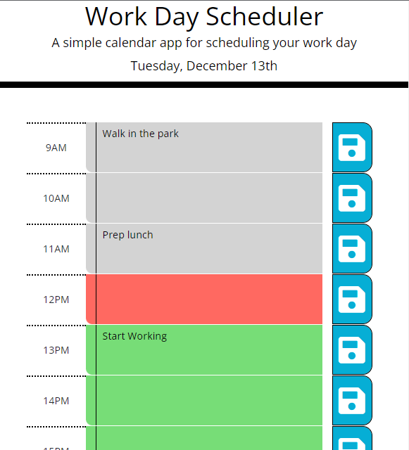

# Daily-Planner-App

## Description

I desired a method to schedule my daily assigned duties, so I built the Daily Planner app.

This programme allows the user to save and edit tasks as text for each working hour of the day. Furthermore, the hours will be color-coded according to the current time, allowing the user to simply determine which task should be done at that time.

My colleague and I decided to start doing it together so we could do some planning and pseudo code together before we started coding, once we started coding, we noticed we needed to keep our files synced due to the fact that we each work on our own computer; after some research, we discovered we could grant access to one's repository, and from there it flows.

We eventually agreed to finish it separately, so after some more searching, we discovered the possibility of forking a branch, so I could have my version and he could continue without impacting each other's repo files.

We concentrated on JQuerry and momentum.js practicing, as well as localstorage html, css, and javascrypt.
The most intriguing aspect of this project was experimenting with github functionality when accessing other people's repositories and forking them.

## Installation

N/A.

## Usage

* A the top of the screen you'll see the actual day.
* Following on each row for each hour you'll have a editable text area so you can add tasks for that time in the day. When clicked the big blue button on the right side will grant that you save this row's information and can have it back in case you close the app.

## Credits

[Victor Biscio](https://github.com/reinkaoss)

## License

MIT License

Copyright (c) [2022] [Guilherme Deretti]

Permission is hereby granted, free of charge, to any person obtaining a copy
of this software and associated documentation files (the "Software"), to deal
in the Software without restriction, including without limitation the rights
to use, copy, modify, merge, publish, distribute, sublicense, and/or sell
copies of the Software, and to permit persons to whom the Software is
furnished to do so, subject to the following conditions:

The above copyright notice and this permission notice shall be included in all
copies or substantial portions of the Software.

THE SOFTWARE IS PROVIDED "AS IS", WITHOUT WARRANTY OF ANY KIND, EXPRESS OR
IMPLIED, INCLUDING BUT NOT LIMITED TO THE WARRANTIES OF MERCHANTABILITY,
FITNESS FOR A PARTICULAR PURPOSE AND NONINFRINGEMENT. IN NO EVENT SHALL THE
AUTHORS OR COPYRIGHT HOLDERS BE LIABLE FOR ANY CLAIM, DAMAGES OR OTHER
LIABILITY, WHETHER IN AN ACTION OF CONTRACT, TORT OR OTHERWISE, ARISING FROM,
OUT OF OR IN CONNECTION WITH THE SOFTWARE OR THE USE OR OTHER DEALINGS IN THE
SOFTWARE.

## Badges

## Tests

Deployed Application: https://guilhermederetti.github.io/Daily-Planner-App/
